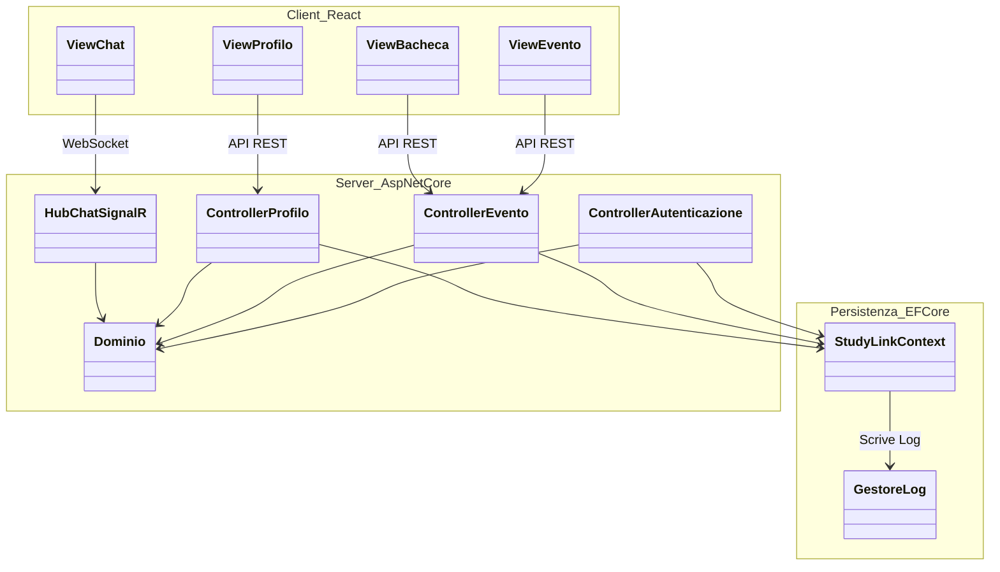
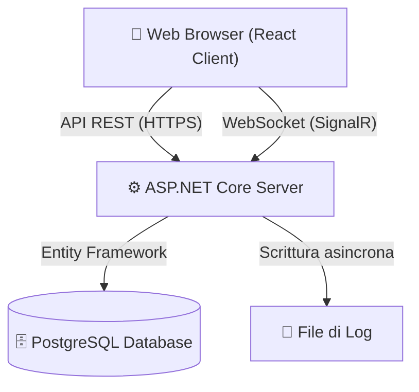
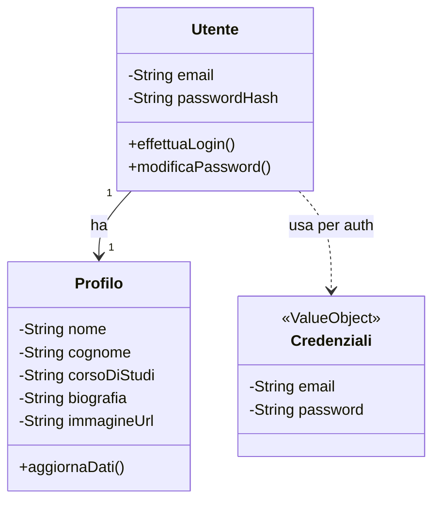
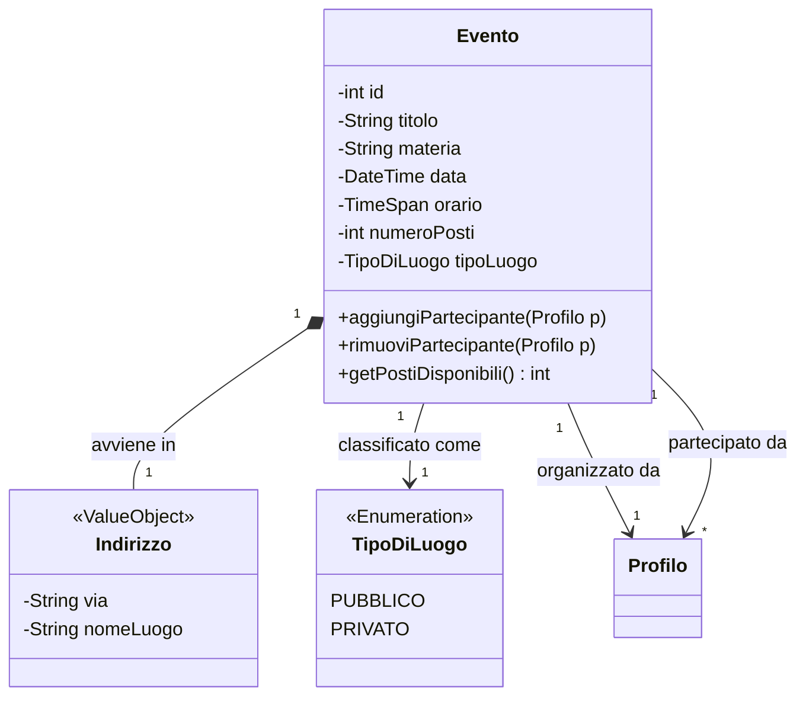
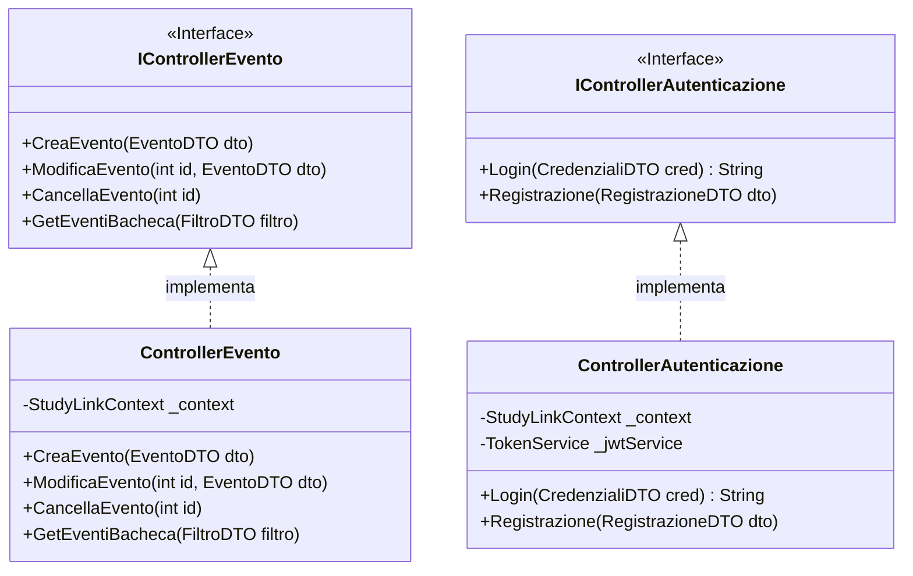
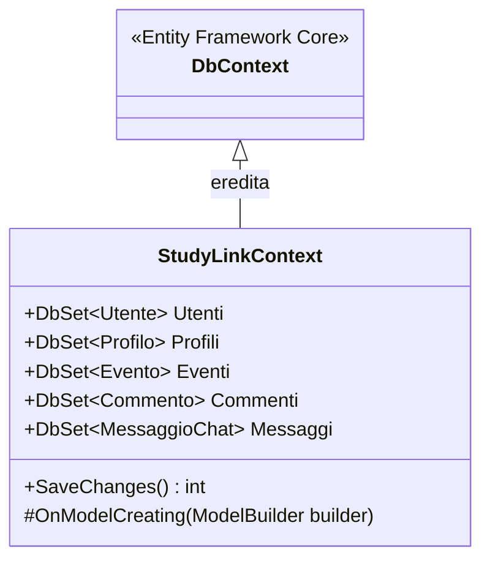
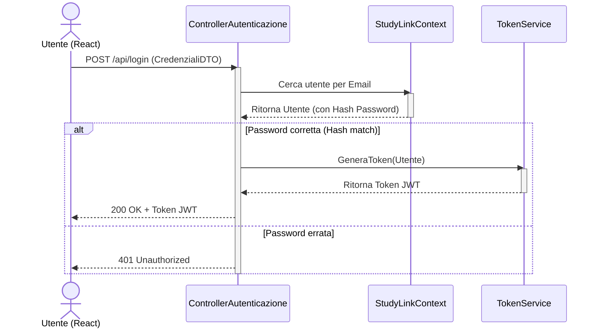
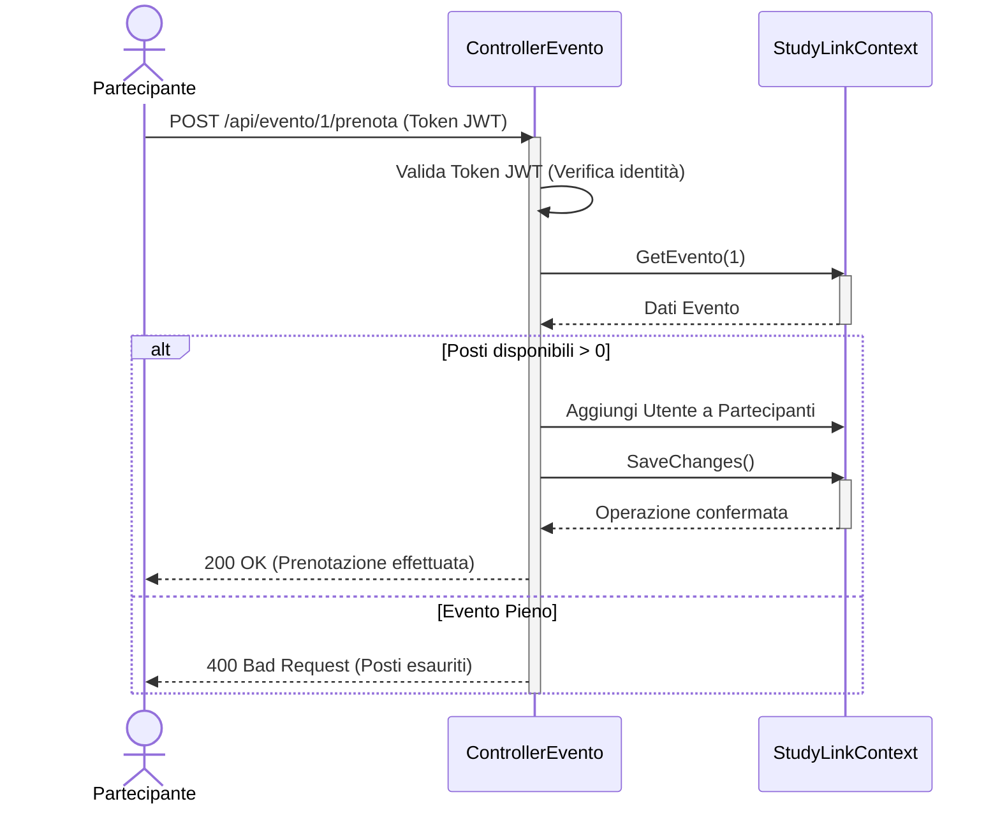

# Diagrammi per il Capitolo 3: Progettazione

In questo documento trovi tutti i diagrammi necessari per completare il Capitolo 3, ispirati alla struttura del progetto JustBit. 

**💡 Come importarli in draw.io:**
Draw.io supporta l'inserimento diretto di codice Mermaid. Invece di disegnare tutto a mano, puoi fare così:
1. Apri draw.io
2. Clicca su **Arrange (Disponi) -> Insert (Inserisci) -> Advanced (Avanzate) -> Mermaid...**
3. Incolla il codice che trovi qui sotto e clicca "Insert".
4. Draw.io genererà i blocchi e le frecce in automatico. Potrai poi ricolorarli, spostarli e sistemarli visivamente come preferisci!

---

## 3.1.4 Diagramma dei Package
Questo diagramma mostra i grandi "blocchi logici" (package) del vostro sistema e le dipendenze tra di essi, riflettendo l'architettura a 3 livelli (Client, Server, Persistenza).


*Spiegazione per il testo del LaTeX:* Il diagramma dei package separa nettamente il client (che si occupa solo della presentazione tramite le View) dal server. Il server contiene i Controller che smistano le richieste REST e il dominio. Il livello di persistenza è stato separato per astrarre la comunicazione con il database tramite l'ORM.

---

## 3.1.5 Diagramma dei Componenti
Mostra i moduli fisici/eseguibili dell'applicazione e le loro interfacce.

```mermaid
componentDiagram
    component "Web Browser (React Client)" as Client
    component "ASP.NET Core Server" as Server {
        port "API REST (HTTP/HTTPS)" as API
        port "WebSocket (SignalR)" as WS
    }
    database "PostgreSQL DB" as DB
    component "File System Locale" as FS

    Client ..> API : Richieste HTTP
    Client ..> WS : Connessione Real-time
    Server ..> DB : Entity Framework (TCP)
    Server ..> FS : Scrittura file di Log
```
*(Nota: Draw.io supporta la sintassi componentDiagram limitatamente. Se non la renderizza bene, puoi usare il formato flowchart standard per i componenti)*:

*Spiegazione:* Il diagramma evidenzia che il Client comunica con il Server tramite due canali: chiamate REST classiche per i dati (Eventi, Profili) e WebSocket tramite SignalR per i messaggi istantanei della chat. Il server a sua volta è l'unico componente autorizzato a comunicare con il Database e con il File System per i Log.

---

## 3.2.1.1 Dettaglio del Modello (Classi)
Nel capitolo dell'analisi hai già disegnato il dominio. Nella *Progettazione*, i diagrammi delle classi diventano più tecnici. Per non fare diagrammi enormi, creiamo diagrammi separati, proprio come JustBit.

### Dettaglio: Utente e Profilo
Qui mostriamo come l'Utente si lega alle credenziali e al profilo.


### Dettaglio: Evento


---

## 3.2.1.4 Dettaglio Controller (Interfacce e Implementazioni)
Questo è cruciale per dimostrare l'uso del pattern MVC e del principio di inversione delle dipendenze (come ha fatto JustBit).


*Spiegazione:* L'uso delle interfacce (`IController...`) permette di disaccoppiare il codice e facilita il collaudo (Dependency Injection). I metodi non prendono in input gli oggetti di Dominio, ma i `DTO` (Data Transfer Object), per non esporre la struttura interna del database al client.

---

## 3.2.1.6 Dettaglio: Persistenza (DbContext)
Come comunicano le classi C# con PostgreSQL? Tramite la classe Contesto.



---

## 3.2.2 Interazione (Diagrammi di Sequenza Implementativi)
Rispetto all'analisi, qui si vede il JWT e l'ORM.

### Diagramma di Sequenza: Autenticazione (Login)


### Diagramma di Sequenza: Prenotazione Evento

